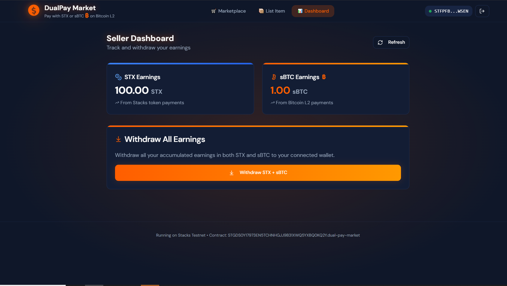
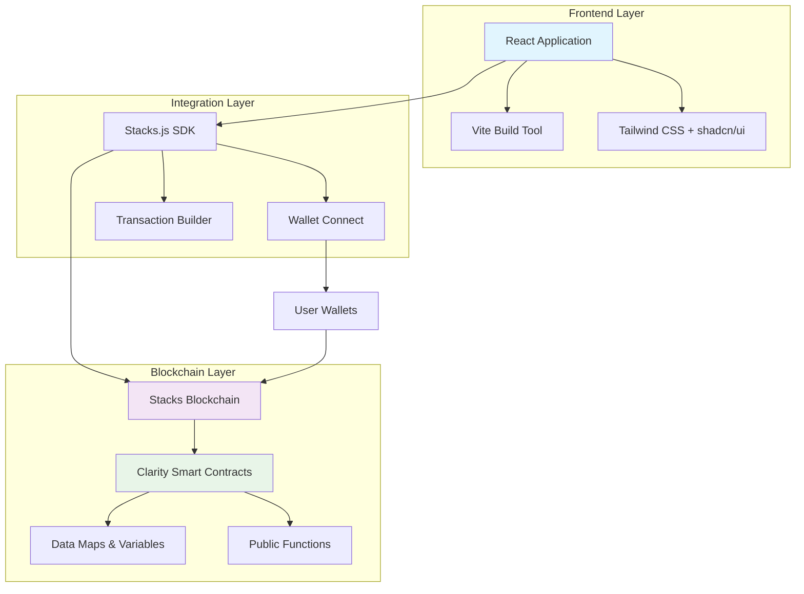
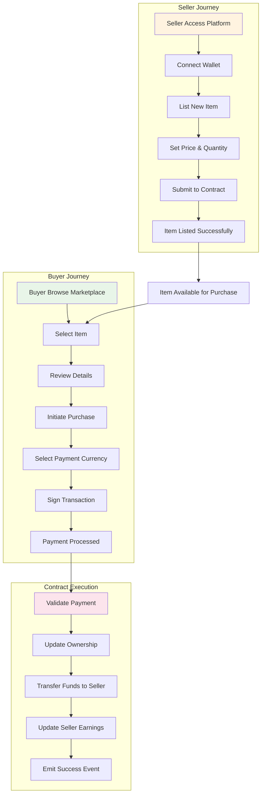
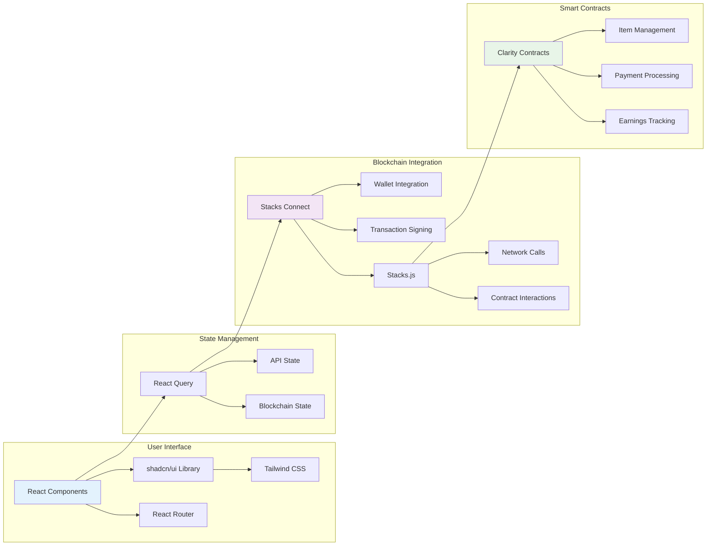

# DualPay Market

[](https://opensource.org/licenses/MIT)
[](https://nodejs.org/)
[](https://reactjs.org/)
[](https://www.typescriptlang.org/)
[](https://vitejs.dev/)
[](https://stacks.org/)

A decentralized marketplace on the Stacks blockchain enabling secure peer-to-peer trading with multi-currency support (STX & SBTC) through Clarity smart contracts.



## Table of Contents

- [DualPay Market](#dualpay-market)
  - [Table of Contents](#table-of-contents)
  - [Overview](#overview)
  - [Features](#features)
  - [Architecture](#architecture)
    - [Component Breakdown](#component-breakdown)
  - [System Flow](#system-flow)
  - [Integration](#integration)
  - [Prerequisites](#prerequisites)
  - [Installation](#installation)
  - [Configuration](#configuration)
    - [Environment Variables](#environment-variables)
    - [Network Configuration](#network-configuration)
  - [Usage](#usage)
    - [For Sellers](#for-sellers)
    - [For Buyers](#for-buyers)
    - [Wallet Integration](#wallet-integration)
  - [API Reference](#api-reference)
    - [Smart Contract Functions](#smart-contract-functions)
      - [Public Functions](#public-functions)
      - [Read-Only Functions](#read-only-functions)
    - [Frontend API](#frontend-api)
  - [Testing](#testing)
    - [Contract Testing](#contract-testing)
    - [Frontend Testing](#frontend-testing)
    - [Integration Testing](#integration-testing)
  - [Deployment](#deployment)
    - [Frontend Deployment](#frontend-deployment)
    - [Contract Deployment](#contract-deployment)
    - [Production Considerations](#production-considerations)
  - [Contributing](#contributing)
    - [Development Guidelines](#development-guidelines)
  - [Security](#security)
    - [Reporting Security Issues](#reporting-security-issues)
  - [License](#license)
  - [Support](#support)

## Overview

DualPay Market is a decentralized marketplace platform built on the Stacks blockchain, leveraging Clarity smart contracts to enable secure, transparent peer-to-peer trading of digital goods and services. The platform supports dual-currency payments using STX (Stacks native token) and SBTC (Bitcoin on Stacks), providing users with flexible payment options while maintaining full decentralization.

The application consists of a modern React-based frontend for user interaction and Clarity smart contracts for on-chain business logic, ensuring trustless transactions and immutable record-keeping.

## Features

- **Decentralized Marketplace**: Fully decentralized item listing and purchasing without intermediaries
- **Multi-Currency Support**: Native support for STX and SBTC payments
- **Smart Contract Security**: All transactions secured by audited Clarity contracts
- **Inventory Management**: Comprehensive seller dashboard for managing listings and stock
- **Earnings Tracking**: Real-time tracking of seller earnings with secure withdrawal mechanisms
- **Responsive UI**: Modern, accessible interface built with React and Tailwind CSS
- **Wallet Integration**: Seamless integration with Stacks-compatible wallets
- **Real-time Updates**: Live transaction status and balance updates

## Architecture

The DualPay Market follows a layered architecture separating concerns between frontend presentation, blockchain interaction, and smart contract logic.



### Component Breakdown

- **Frontend Layer**: Handles user interface, state management, and API interactions
- **Integration Layer**: Manages blockchain connectivity, wallet interactions, and transaction signing
- **Blockchain Layer**: Contains the core business logic in immutable smart contracts

## System Flow

The following diagram illustrates the complete user journey from item listing to purchase completion.



## Integration

The system integrates multiple technologies to provide a seamless decentralized experience.



## Wallet Integration

The application uses Stacks Connect and WalletConnect for secure wallet connections and transaction signing. Key packages include:

- `@stacks/connect`: ^8.2.4 - Wallet connection and transaction handling
- `@stacks/network`: ^7.3.1 - Network configuration for Stacks blockchain
- `@stacks/transactions`: ^7.3.1 - Transaction building and signing

This enables seamless integration with popular Stacks wallets like Hiro Wallet and Xverse.

## Prerequisites

- Node.js 18.x or higher
- npm or yarn package manager
- Git
- A Stacks-compatible wallet (e.g., Hiro Wallet, Xverse)
- Clarinet (for contract development and testing)

## Installation

1. **Clone the Repository**
   ```bash
   git clone https://github.com/your-org/dual-pay-market.git
   cd dual-pay-market
   ```

2. **Install Dependencies**
   ```bash
   npm install
   ```

3. **Environment Setup**
   ```bash
   cp .env.example .env
   # Edit .env with your configuration
   ```

4. **Start Development Server**
   ```bash
   npm run dev
   ```

The application will be available at `http://localhost:8080`.

## Configuration

### Environment Variables

Create a `.env` file in the root directory:

```env
VITE_STACKS_NETWORK=mainnet
VITE_CONTRACT_ADDRESS=SP...
VITE_APP_NAME=DualPay Market
```

### Network Configuration

The application supports both mainnet and testnet deployments. Configure the network in your environment variables.

## Usage

### For Sellers

1. Connect your Stacks wallet
2. Navigate to the seller dashboard
3. Click "List New Item"
4. Fill in item details (name, description, price, quantity)
5. Confirm the transaction
6. Monitor sales and earnings

### For Buyers

1. Browse available items
2. Select an item to purchase
3. Choose payment currency (STX or SBTC)
4. Confirm the transaction
5. Receive item access/details

### Wallet Integration

The platform integrates with popular Stacks wallets for secure transaction signing and balance management.

## API Reference

### Smart Contract Functions

#### Public Functions

- `list-item(name, desc, price, quantity)`: List a new item for sale
- `purchase-item(item-id, payment-amount)`: Purchase an item
- `withdraw-earnings(amount)`: Withdraw seller earnings

#### Read-Only Functions

- `get-item(item-id)`: Get item details
- `get-seller-earnings(seller)`: Get seller earnings balance

### Frontend API

The React application exposes the following key components:

- `Marketplace`: Main browsing interface
- `ItemCard`: Individual item display
- `SellerDashboard`: Seller management interface
- `WalletConnect`: Wallet connection component

## Testing

### Contract Testing

```bash
cd clarity-contract
clarinet test
```

### Frontend Testing

```bash
npm run test
```

### Integration Testing

```bash
npm run test:e2e
```

## Deployment

### Frontend Deployment

1. Build the application:
   ```bash
   npm run build
   ```

2. Deploy the `dist` folder to your hosting provider (Vercel, Netlify, etc.)

### Contract Deployment

1. Configure deployment settings in `clarity-contract/settings/`
2. Use Clarinet to deploy:
   ```bash
   clarinet deployments generate --devnet
   clarinet console
   ```

### Production Considerations

- Enable HTTPS
- Configure proper CORS settings
- Set up monitoring and logging
- Implement rate limiting

## Contributing

We welcome contributions to DualPay Market. Please follow these guidelines:

1. Fork the repository
2. Create a feature branch: `git checkout -b feature/your-feature`
3. Make your changes and add tests
4. Ensure all tests pass: `npm run test`
5. Commit your changes: `git commit -am 'Add new feature'`
6. Push to the branch: `git push origin feature/your-feature`
7. Submit a pull request

### Development Guidelines

- Follow the existing code style
- Write comprehensive tests for new features
- Update documentation for API changes
- Ensure accessibility compliance

## Security

Security is paramount in a decentralized marketplace. Key security measures include:

- Smart contract audits
- Input validation on all user inputs
- Secure wallet integration
- Transaction signing verification
- Rate limiting and abuse prevention

### Reporting Security Issues

Please report security vulnerabilities to security@dualpay.market. Do not create public issues for security concerns.

## License

This project is licensed under the MIT License - see the [LICENSE](LICENSE) file for details.

## Support

- **Documentation**: [docs.dualpay.market](https://docs.dualpay.market)
- **Community Forum**: [forum.dualpay.market](https://forum.dualpay.market)
- **Email Support**: support@dualpay.market
- **Discord**: [Join our Discord](https://discord.gg/dualpay)

For technical support, please provide:
- Your environment details
- Steps to reproduce issues
- Relevant log outputs
- Transaction IDs (if applicable)
