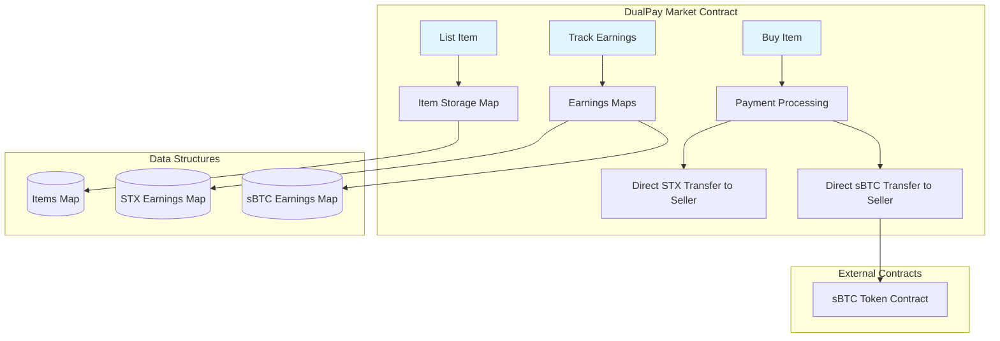

# DualPay Market

[](https://github.com/hirosystems/clarinet)
[](https://stacks.co)
[](LICENSE)
[](tests/)

A decentralized marketplace smart contract on the Stacks blockchain that enables sellers to list items for sale and buyers to purchase them using either STX or sBTC tokens. Built with Clarity for secure, trustless transactions.

## Table of Contents

- [DualPay Market](#dualpay-market)
  - [Table of Contents](#table-of-contents)
  - [Features](#features)
  - [Quick Start](#quick-start)
    - [Prerequisites](#prerequisites)
    - [Installation](#installation)
  - [Usage](#usage)
    - [For Sellers](#for-sellers)
      - [List an Item](#list-an-item)
      - [Withdraw Earnings](#withdraw-earnings)
    - [For Buyers](#for-buyers)
      - [Purchase with STX](#purchase-with-stx)
      - [Purchase with sBTC](#purchase-with-sbtc)
    - [Read-Only Functions](#read-only-functions)
      - [Get Item Details](#get-item-details)
      - [Check Seller Earnings](#check-seller-earnings)
  - [Testing](#testing)
    - [Test Coverage](#test-coverage)
  - [Deployment](#deployment)
    - [Testnet Deployment](#testnet-deployment)
    - [Mainnet Deployment](#mainnet-deployment)
  - [📚 API Reference](#-api-reference)
    - [Public Functions](#public-functions)
      - [`list-item`](#list-item)
      - [`buy-item`](#buy-item)
      - [`withdraw-earnings`](#withdraw-earnings-1)
    - [Read-Only Functions](#read-only-functions-1)
      - [`get-item`](#get-item)
      - [`get-next-item-id`](#get-next-item-id)
      - [`get-seller-stx`](#get-seller-stx)
      - [`get-seller-sbtc`](#get-seller-sbtc)
  - [🔒 Security](#-security)
    - [Audit Status](#audit-status)
    - [Known Limitations](#known-limitations)
  - [🤝 Contributing](#-contributing)
    - [Development Setup](#development-setup)
  - [📄 License](#-license)
  - [🙏 Acknowledgments](#-acknowledgments)
  - [📞 Support](#-support)



## Features

- **Multi-Token Support**: Accept payments in STX or sBTC
- **Direct Payment System**: Secure payments sent directly to sellers
- **Seller Earnings Tracking**: Separate tracking for STX and sBTC earnings
- **Inventory Management**: Automatic quantity updates and item deactivation
- **Security First**: Comprehensive input validation and error handling

## Quick Start

### Prerequisites

- [Node.js](https://nodejs.org/) (v16 or higher)
- [Clarinet](https://github.com/hirosystems/clarinet) (v2.x)
- [Stacks Wallet](https://wallet.stacks.org/) with testnet STX

### Installation

1. **Clone the repository**
   ```bash
   git clone <repository-url>
   cd dual-pay-market
   ```

2. **Install dependencies**
   ```bash
   npm install
   ```

3. **Run tests**
   ```bash
   npm test
   ```

4. **Check contracts**
   ```bash
   clarinet check
   ```

## Usage

### For Sellers

#### List an Item
```clarity
(contract-call? .dual-pay-market list-item
  "Vintage Guitar"
  "A beautiful vintage guitar in excellent condition"
  u1000000  ;; Price: 1 STX (in micro-units)
  u5        ;; Quantity: 5 available
)
```

### For Buyers

#### Purchase with STX
```clarity
(contract-call? .dual-pay-market buy-item
  u1        ;; Item ID
  u2        ;; Quantity to buy
  false     ;; Pay with STX (not sBTC)
)
```

#### Purchase with sBTC
```clarity
(contract-call? .dual-pay-market buy-item
  u1        ;; Item ID
  u1        ;; Quantity to buy
  true      ;; Pay with sBTC
)
```

### Read-Only Functions

#### Get Item Details
```clarity
(contract-call? .dual-pay-market get-item u1)
;; Returns: (some {name: "Item Name", desc: "Description", price: u1000000, quantity: u5, seller: 'ST..., active: true})
```

#### Check Seller Earnings
```clarity
;; STX earnings
(contract-call? .dual-pay-market get-seller-stx 'ST1SJ3DTE5DN7X54YDH5D64R3BCB6A2AG2ZQ8YPD5)

;; sBTC earnings
(contract-call? .dual-pay-market get-seller-sbtc 'ST1SJ3DTE5DN7X54YDH5D64R3BCB6A2AG2ZQ8YPD5)
```

## Testing

Run the comprehensive test suite:

```bash
npm test
```

Run tests with coverage:

```bash
npm run test:report
```

Watch mode for development:

```bash
npm run test:watch
```

### Test Coverage

- Item listing with validation
- STX and sBTC payment processing
- Inventory management
- Earnings withdrawal
- Error handling
- Read-only functions

## Deployment

### Testnet Deployment

1. **Configure your wallet**
   ```bash
   clarinet wallet new
   ```

2. **Generate deployment plan**
   ```bash
   clarinet deployments generate --testnet --medium-cost
   ```

3. **Apply deployment**
   ```bash
   clarinet deployments apply --testnet
   ```

### Mainnet Deployment

⚠️ **Warning**: Mainnet deployment is irreversible. Ensure all tests pass and code is audited.

```bash
clarinet deployments generate --mainnet --high-cost
clarinet deployments apply --mainnet
```

## API Reference

### Public Functions

#### `list-item`
Lists a new item for sale.

**Parameters:**
- `name` (string-ascii 100): Item name
- `desc` (string-ascii 200): Item description
- `price` (uint): Price in micro-units
- `quantity` (uint): Available quantity

**Returns:** `(response uint uint)`

#### `buy-item`
Purchases an item with specified payment method.

**Parameters:**
- `item-id` (uint): Item identifier
- `quantity-to-buy` (uint): Quantity to purchase
- `pay-with-sbtc` (bool): True for sBTC, false for STX

**Returns:** `(response bool uint)`

#### `withdraw-earnings`
Withdraw earnings (deprecated - payments now go directly to sellers).

**Returns:** `(response bool uint)`

### Read-Only Functions

#### `get-item`
Retrieves item details.

**Parameters:**
- `id` (uint): Item identifier

**Returns:** `(optional {name: (string-ascii 100), desc: (string-ascii 200), price: uint, quantity: uint, seller: principal, active: bool})`

#### `get-next-item-id`
Gets the next available item ID.

**Returns:** `uint`

#### `get-seller-stx`
Gets STX earnings for a seller.

**Parameters:**
- `seller` (principal): Seller address

**Returns:** `uint`

#### `get-seller-sbtc`
Gets sBTC earnings for a seller.

**Parameters:**
- `seller` (principal): Seller address

**Returns:** `uint`

## Security

### Audit Status
- [ ] External security audit pending
- [x] Comprehensive test coverage
- [x] Input validation
- [x] Access control checks

### Known Limitations
- No dispute resolution mechanism
- No item delivery confirmation
- Single seller per item

## Contributing

1. Fork the repository
2. Create a feature branch (`git checkout -b feature/amazing-feature`)
3. Commit your changes (`git commit -m 'Add amazing feature'`)
4. Push to the branch (`git push origin feature/amazing-feature`)
5. Open a Pull Request

### Development Setup

```bash
# Install dependencies
npm install

# Run tests in watch mode
npm run test:watch

# Check contracts on file changes
clarinet check
```

## License

This project is licensed under the MIT License - see the [LICENSE](LICENSE) file for details.

## Acknowledgments

- [Stacks](https://stacks.co) for the blockchain infrastructure
- [Clarinet](https://github.com/hirosystems/clarinet) for development tools
- [Hiro Systems](https://www.hiro.so) for Clarity language support

## Support

- **Issues**: [GitHub Issues](https://github.com/your-repo/issues)
- **Discussions**: [GitHub Discussions](https://github.com/your-repo/discussions)
- **Discord**: [Join our community](https://discord.gg/stacks)

---

**Built on the Stacks blockchain**